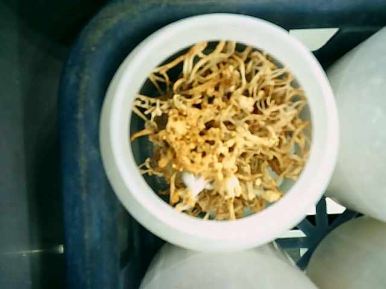

# Cordyceps Detection using YOLOv5

This project was conducted during an internship at the Korea Electronics Technology Institute (KETI) and focuses on detecting cordyceps images using a modified version of the YOLOv5 object detection model.

---

## Overview

- **Model Used**: YOLOv5
- **Application**: Automated image classification and mold detection for cordyceps
- **Type**: Research & development internship project
- **Institute**: Korea Electronics Technology Institute (KETI)

---

## Project Structure

```
.
├── data/
│   └── cordyceps/             # Raw images used for detection and training
├── labeledImage/              # YOLO-formatted labeled images after preprocessing and annotation
├── runs/
│   └── detect/                # Outputs and logs from object detection runs (e.g., bounding box results)
│   └── train/                 # Model weights and logs from training process
├── detect.py                  # YOLOv5 script used for running inference (object detection)
├── train.py                   # YOLOv5 script used for model training
└── imagePreprocessing.py      # Script for resizing and preparing images prior to training/detection
```

---

## Usage Instructions

### 1. Labeling Images

- Launch `labelImg`:
  - Windows executable: `C:\windows_v1.8.1\labelimg.exe`
  - **Important**: Set mode to `YOLO` after launching
  - Classes must be defined in `data/predefined_classes.txt`

### 2. Virtual Environment Setup

```bash
# Create venv
python -m venv venv

# Activate (Windows)
venv\Scripts\activate.bat

# Deactivate
> deactivate
```

If a specific Python version is required:
```bash
/path/to/python.exe -m venv venv_name
```

### 3. Image Preprocessing

Run the preprocessing script before training or detection:
```bash
python imagePreprocessing.py
```

---

## Training the Model

Training is conducted using YOLOv5's built-in training script:
```bash
python train.py \
  --img 512 \
  --batch 16 \
  --epochs 200 \
  --data data/cordyceps.yaml \
  --weights runs/train/mold2/weights/best.pt
```

---

## Running Detection

To detect objects using a trained model:
```bash
python detect.py \
  --weights runs/train/mold2/weights/best.pt \
  --img 512 \
  --source data/custom \
  --save-txt
```

- You may adjust **percentage filtering** settings in `detect.py` to control detection sensitivity.
- Always verify filenames and paths before executing.

---

## Project Phases

This project consists of two consecutive object detection tasks:

1. **Cordyceps Filtering Model**: Detects and crops only the cordyceps from photos that include multiple background objects.
2. **Mold Classification Model**: Applies an additional YOLOv5 detection model to the cropped cordyceps images to distinguish between clean and mold-infected samples.

---

## Accuracy and Evaluation

- The final model achieved a detection accuracy of **98.94%**, verified using test data from both stages.

---

## Visual Examples

### 1. Raw Image Example
Image containing various objects including cordyceps:



### 2. Cordyceps Extraction Result
Result after running the first-stage detection to isolate cordyceps:

/i2_0_0_000557.jpg)

### 3. Mold Detection Result
Second-stage model output showing mold detection with probability estimation:

/i2_21_2_183443.jpg)

---

## Notes

- This project uses an external YOLOv5 repository as the core engine, with modifications made for dataset and logic integration.
- Emphasis was placed on automation, preprocessing, and practical deployment within a lab setting.
